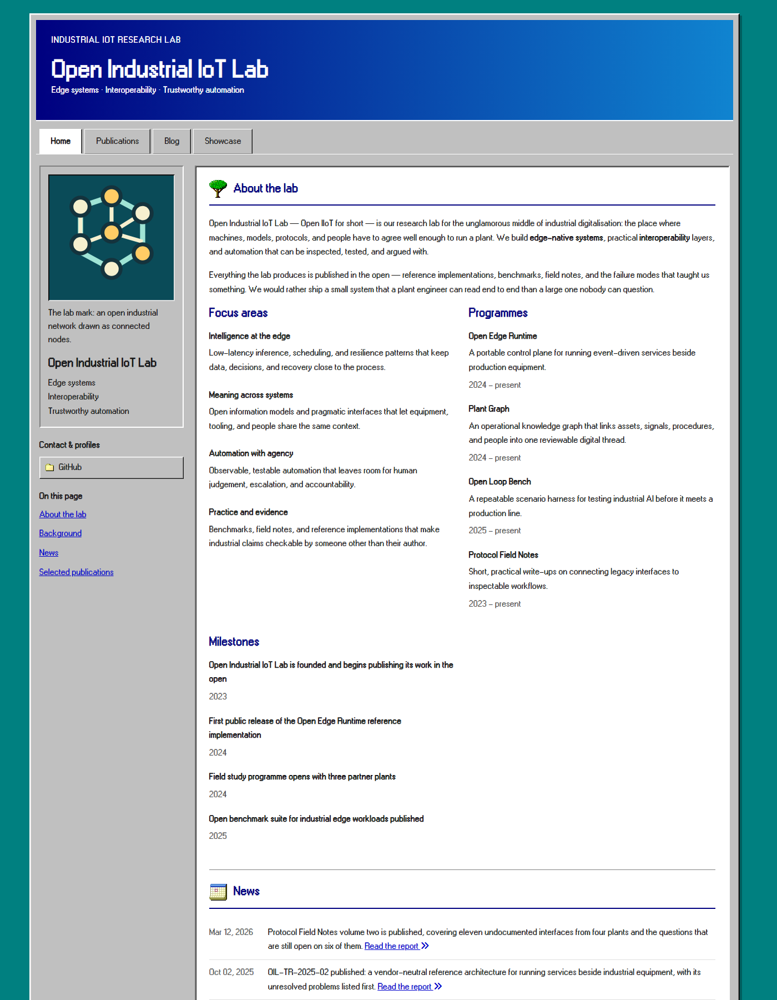

# Open Industrial IoT Lab — homepage

The website for **Open Industrial IoT Lab** — the lab's own homepage, covering our work on
edge-native industrial systems, interoperability, and trustworthy automation.

**Live site: <https://open-iiot-lab.github.io/>** — published by GitHub Pages from this
repository, which is named `Open-IIoT-Lab.github.io` so that it serves as the organization
homepage.

## Naming

The site uses three forms of the same name. Keep them in step when you edit:

| Form | Where it is used |
| --- | --- |
| **Open Industrial IoT Lab** | The full name: page titles, the masthead, the footer, publication authors |
| Open IIoT Lab | The short form, for running text where the full name is too long |
| Open IIoT | The abbreviation: the web address `open-iiot-lab.github.io`, the GitHub organization `Open-IIoT-Lab`, and the report identifiers `OIL-TR-…` / `OIL-WP-…` |

The full name lives in `_data/profile.yml` (`primary_name`, `navbar_name`) and `_config.yml`
(`title`); the report prefix is written per publication in `pub_pre`.

The site is built with Jekyll on top of the
[Nostalgia 1990s academic homepage template](https://github.com/luost26/academic-homepage-nostalgia-1990s)
by [luost26](https://github.com/luost26), which is itself a variant of
[academic-homepage](https://github.com/luost26/academic-homepage). The late-1990s desktop design
language — teal backdrop, beveled silver chrome, navy masthead, tabbed navigation, classic icons —
comes from that template; the content, the lab mark, and the section structure are the lab's own.



## Preview locally

The site is plain Jekyll; there is no build step for the content itself.

```bash
bundle install
bundle exec jekyll serve
```

Then open <http://127.0.0.1:4000/>. With `baseurl: ""` in `_config.yml` the site is served from
the root of the local server, exactly as it is in production, so internal links work as written.

`bundle exec jekyll build` writes the generated site to `_site/`.

## What is in the repository

| Path | What it holds |
| --- | --- |
| `_data/profile.yml` | Lab name, strapline, eyebrow, contact links, about text, focus areas, programmes, milestones |
| `_data/navigation.yml` | The four navigation tabs, in order |
| `_data/display.yml` | Which homepage sections are shown, how many news items, footer text |
| `_data/authors.yml` | Author names used (and highlighted) in publication lists |
| `_news/*.md` | One file per news line on the homepage |
| `_publications/<year>/*.md` | One file per report, paper, or working paper |
| `_posts/*.md` | Blog articles (the lab notebook) |
| `_showcase/<group>/*.md` | Showcase cards, grouped by their `group:` field |
| `index.html`, `publications.html`, `blog.html`, `showcase.html`, `404.html` | Page shells; they mostly assemble the widgets below |
| `_layouts/`, `_includes/` | Template engine: page layouts and the widgets each page uses |
| `assets/` | Theme CSS and JS, the Windows 95-style font, the classic icon set, the lab mark |
| `.github/workflows/pages.yml` | CI: builds the site on every push and pull request, and deploys it to GitHub Pages from `main` |

Content lives in data files and Markdown; you should not need to touch `_layouts/`, `_includes/`,
or `assets/` to keep the site up to date.

## Editing content

**Lab identity and homepage background** — `_data/profile.yml`. The three background groups reuse
the template's `education`, `experience`, and `awards` keys; the headings shown on the page are
renamed to *Focus areas*, *Programmes*, and *Milestones* through the `section_headings` map in the
same file, so the widget itself stays untouched. Uncomment the `email:` line and add the lab's real
address to show an email button in the contact rail. The lab's name, eyebrow line, and subtitle
lines are in the same file — see [Naming](#naming) above for the three forms of the name.

**An author name** — `_data/authors.yml`. The lab publishes as a lab, so `Open Industrial IoT Lab`
is the highlighted author of every report; the working-group names below it are ordinary entries.
Add lab members here if you would rather list people.

**A news line** — add `_news/YYYY-MM-DD-short-title.md`:

```yaml
---
title: >-
    What happened, in one sentence. <a href="publications">Optional link <i class="fas fa-angle-double-right"></i></a>
date: 2026-01-15 09:00:00 +0800
---
```

**A publication** — add `_publications/<year>/<year>-short-title.md`. Set `selected: true` to show
it on the homepage. Fields: `title`, `date`, `selected`, `pub_pre`, `pub`, `pub_date`, `pub_last`
(trailing badges), `abstract`, `authors` (keys from `_data/authors.yml`), `links`, and optionally
`cover` (an image path; without it the template draws a deterministic dithered cover from the
title) and `semantic_scholar_id` (adds a live citation count).

**A blog article** — add `_posts/YYYY-MM-DD-short-title.md` with `layout: blog_post`, `title`,
`date`, and `tags`. Articles are published under `/blog/YYYY/MM/DD/slug/`; headings in the article
become the "On this page" list automatically.

**A showcase card** — add `_showcase/<group>/<name>.md`:

```yaml
---
show: true
width: 6          # 1-12; 6 is half width, 12 is full width
date: 2026-01-15 09:00:00 +0800
group: Programmes
---

<div class="p-4">
    <h3>Card title</h3>
    <p>Plain HTML, styled by the theme's classic card look.</p>
</div>
```

Cards are ordered by `date` (newest first) and grouped by `group` (the newest card's group appears
first).

## Publishing

Deployment is automatic. `.github/workflows/pages.yml` builds the site with the Gemfile in this
repository and publishes it with GitHub Pages:

- every push to `main` builds **and** deploys — <https://open-iiot-lab.github.io/> updates within a
  minute or two;
- pull requests only build the site, so a broken page is caught before it reaches `main`;
- runs can also be started by hand from the Actions tab (`workflow_dispatch`).

Repository settings that make this work, for reference:

1. **Settings → Pages → Build and deployment → Source: GitHub Actions.** Pages builds with the
   workflow, not with GitHub's own Jekyll pipeline, because the site needs the `jekyll-email-protect`
   plugin, which the built-in pipeline does not allow.
2. **The repository name matters.** For an organization site, the repository must be
   `Open-IIoT-Lab.github.io`, the default branch must be `main`, and the repository must be public —
   GitHub Pages is not available for private repositories on the Free plan.
3. **`baseurl` stays empty** in `_config.yml` because the site is served from the root of
   `open-iiot-lab.github.io`. If the site ever moves to a project path such as
   `https://open-iiot-lab.github.io/lab/`, set `baseurl: "/lab"`.

The template's debugging widgets on the homepage will show a warning box whenever `baseurl` does
not match the path the site is actually served from.

## Replace before relying on it

The site ships with coherent but **sample** content so the design can be judged in context. It is
the lab's own site, so replace the samples with real material before treating it as a record of
actual work:

- The reports in `_publications/`, the news lines, the blog articles, and the showcase cards
  describe the kind of work the lab does; they are not claims about real projects, and every date,
  identifier, and number in them is illustrative.
- The contact rail links to the lab's GitHub organization. Add the lab's real email address in
  `_data/profile.yml` (`email:`) to show an email button as well.
- `assets/images/open-iiot-mark.svg` and `assets/images/favicon.svg` are the lab mark and its
  favicon; replace them if the lab has its own artwork.
- `assets/images/screenshots/homepage.png` is the screenshot used at the top of this README; refresh
  it when the homepage changes.

## Credits and licence

The theme is adapted from [luost26/academic-homepage-nostalgia-1990s](https://github.com/luost26/academic-homepage-nostalgia-1990s),
released under the MIT licence — see [`LICENSE`](LICENSE), which is kept unchanged. The Windows 98
icon set, the W95FA and MS Sans Serif fonts, and the other artwork keep their own licences and
provenance records; those notices ship with the assets (`assets/images/classic/NOTICE.md`,
`assets/fonts/classic/NOTICE.md`) and are repeated in the collapsed *Artwork credits* section in
the site footer. Please keep those credits and licence files in place when reusing the theme.
